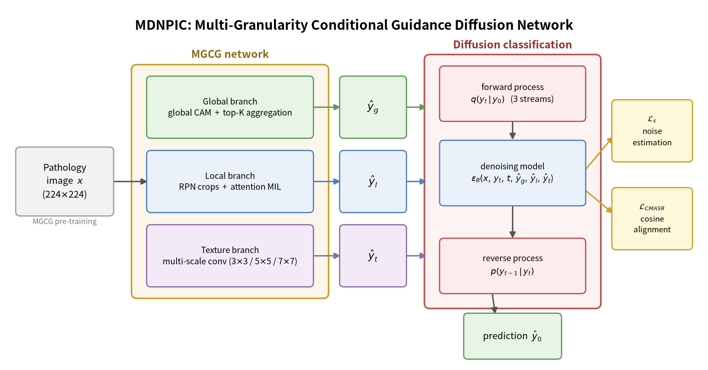

<div align="center">

# MDNPIC

**Multi-Granularity Conditional Guidance Diffusion Network with Semantic Alignment Regularization for Pathology Image Classification**

[](https://www.python.org/)
[](https://pytorch.org/)
[](./LICENSE)

</div>

This is the official PyTorch implementation of the paper:

> **Multi-Granularity Conditional Guidance Diffusion Network with Semantic Alignment Regularization for Pathology Image Classification**
>
> Hongbo Zhao, Miao Zhang, Ping Jiang, Yi Shen

## Overview

Pathological image classification requires integrating **global tissue
structures**, **local cellular details**, and the **diagnostic logic** of
pathologists, while bridging the cross-scale semantic gap. MDNPIC emulates the
pathologist workflow of *"global observation → lesion localization →
pathological analysis"* with three key components:

1. **MGCG — Multi-Granularity Conditional Guidance network**. A
   three-dimensional conditional guidance system that produces discriminative
   priors from three granularities:
   - **Global branch**: class activation maps (CAM) with top-K aggregation for
     lesion-level global structure;
   - **Local branch**: RPN-guided ROI cropping with attention-based MIL
     pooling for local lesion regions;
   - **Texture branch**: multi-scale convolutional blocks (3×3 / 5×5 / 7×7
     kernels) with residual connections and channel (SE) attention, extracting
     cellular texture details from the whole image.
2. **DC — Diffusion Classification network**. A conditional denoising model
   ε_θ(x, y_t, t, ŷ_g, ŷ_l, ŷ_t) that embeds the multi-granularity priors into
   every step of the forward and reverse diffusion process, replacing the
   single-condition prior of conventional diffusion classifiers.
3. **CMASR — Cross-Modal Semantic Alignment Regularization**. A cosine
   similarity based constraint that aligns the multi-granularity feature
   streams to a shared noise-related target in the latent space, activated
   only when the similarity falls below a threshold. Compared with MMD
   regularization, CMASR converges faster and trains more stably.

<div align="center">
  
</div>

## Main Results

Results reported in the paper (Accuracy / Precision / Recall / F1 / Kappa in %).

**MHIST** (binary, HP vs. SSA)

| Method | Architecture | Accuracy | Extra Training Data |
| --- | --- | --- | --- |
| SwAV | ResNet-50 | 77.99 | TCGA (SSL) |
| Barlow Twins | ResNet-50 | 81.27 | TCGA (SSL) |
| DINO | ViT-S | 79.43 | TCGA (SSL) |
| DiffMIC | U-Net (Diffusion) | 84.65 | None |
| **MDNPIC (Ours)** | U-Net (Diffusion) | **85.47** | None |

**Chaoyang** (4-class colorectal tissue)

| Method | Accuracy | Precision | Recall | F1-Score |
| --- | --- | --- | --- | --- |
| OUSM | 80.56 | 74.77 | 73.30 | 73.68 |
| Co-teaching | 79.41 | 74.56 | 70.75 | 71.99 |
| DivideMix | 77.22 | 70.65 | 69.07 | 69.74 |
| Co-correcting | 83.09 | 76.47 | 78.85 | 77.59 |
| HAS-NRL | 83.39 | 78.34 | 75.44 | 76.56 |
| SSS-DT | 85.77 | 80.63 | 79.18 | 77.69 |
| DiffMIC | 85.97 | 81.33 | 81.03 | 81.16 |
| **MDNPIC (Ours)** | **86.91** | **83.76** | **81.17** | **82.28** |

**HITAFH-GCML** (6-class gastric cancer tissue)

| Method | Accuracy | Precision | Recall | F1-Score | Kappa |
| --- | --- | --- | --- | --- | --- |
| DiffMIC | 95.71 | 95.82 | 95.56 | 95.57 | 94.78 |
| **MDNPIC (Ours)** | **96.26** | **96.37** | **96.59** | **96.46** | **95.44** |

Ablation study (Acc / F1 in %):

| Combination | MGCG | CMASR | MHIST | Chaoyang | HITAFH-GCML |
| --- | --- | --- | --- | --- | --- |
| Basic diffusion | – | – | 82.60 / 74.85 | 83.46 / 76.98 | 94.98 / 95.12 |
| + MGCG | ✓ | – | 84.98 / 78.56 | 85.88 / 79.23 | 95.86 / 95.98 |
| **MDNPIC (full)** | ✓ | ✓ | **85.47 / 79.60** | **86.91 / 82.28** | **96.26 / 96.46** |

## Getting Started

### 1. Environment

```bash
conda create -n mdnpic python=3.9 -y
conda activate mdnpic
pip install -r requirements.txt
```

> The code was developed with PyTorch 1.12.1 + CUDA. Newer PyTorch versions
> (up to 2.x) are supported.

### 2. Data Preparation

Create a `data/` directory with the following layout:

```
data/
├── MHIST/                       # binary HP/SSA dataset
│   ├── images/                  # 3,152 H&E patches (224x224)
│   └── annotations.csv          # columns: Image Name, MajorLabel, Partition
├── Chaoyang/                    # 4-class colorectal tissue dataset
│   ├── train/
│   │   ├── tissue1/ ... tissue4/
│   └── test/
│       ├── tissue1/ ... tissue4/
└── HITAFH-GCML/                 # 6-class gastric cancer tissue dataset
    ├── train/
    │   ├── <class_name>/ ...
    └── test/
        ├── <class_name>/ ...
```

- **MHIST** can be downloaded from its official Harvard Dataverse release
  (*"A Petri Dish for Histopathology"*, Wei et al.).
- **Chaoyang** is released with the HAS-NRL paper; please follow the official
  distribution.
- **HITAFH-GCML** was collected at the affiliated hospital; it is available
  from the authors upon reasonable request for research purposes.

All images are resized to 224×224 automatically; grayscale images are
replicated to 3 channels so that the ImageNet pre-trained backbones can be
reused. Random rotation and flipping are applied during training.

### 3. Training

```bash
bash scripts/train_mhist.sh        # MHIST
bash scripts/train_chaoyang.sh     # Chaoyang
bash scripts/train_hitafh_gcml.sh  # HITAFH-GCML
```

Each run (i) pre-trains the MGCG guidance network with cross-entropy for 30
epochs, then (ii) trains the conditional diffusion model with the noise
estimation loss + CMASR. Logs, configs and checkpoints are saved under
`results_<dataset>/logs/<dataset>/split_0/`.

Useful flags:

| Flag | Description |
| --- | --- |
| `--train_guidance_only` | Only pre-train the MGCG guidance network |
| `--add_ce_loss` | Add cross-entropy auxiliary loss on ŷ_0 reparameterization |
| `--noise_prior` | Use a zero-mean prior at timestep T |
| `--resume_training` | Resume from the latest checkpoint |
| `--seed` | Random seed (default 1234) |

### 4. Testing

```bash
bash scripts/test_mhist.sh
bash scripts/test_chaoyang.sh
bash scripts/test_hitafh_gcml.sh
```

Testing reports Accuracy, Kappa, macro-F1 and the confusion matrix, and saves
per-timestep t-SNE plots (`t-sne/tsne_t_*.png`) that visualize the reverse
diffusion classification procedure. Use
`visualization/tsne_animation.py` to assemble the plots into an animated GIF:

```bash
python visualization/tsne_animation.py --directory results_chaoyang/logs/chaoyang/split_0/t-sne
```

### 5. Grad-CAM Visualization

`visualization/gradcam.py` provides Grad-CAM utilities to inspect the lesion
saliency maps produced by the global branch of MGCG.

## Repository Structure

```
MDNPIC
├── main.py                  # entry point (train / test)
├── trainer.py               # training & evaluation pipeline
├── networks.py              # conditional denoising model eps_theta
├── alignment.py             # CMASR (cosine similarity regularization)
├── metrics.py               # metrics & generic training utilities
├── mgcg/                    # Multi-Granularity Conditional Guidance network
│   ├── mgcg.py              #   MGCG: global + local + texture branches
│   ├── texture.py           #   multi-scale texture branch (Eq. 4)
│   ├── modules.py           #   global/local/attention-MIL modules
│   └── tools.py             #   crop & aggregation utilities
├── diffusion/               # diffusion process utilities
│   ├── utils.py             #   q_sample / p_sample / sampling loop
│   └── ema.py               #   exponential moving average
├── data/loading.py          # MHIST / Chaoyang / HITAFH-GCML datasets
├── visualization/           # Grad-CAM & t-SNE animation tools
├── configs/                 # per-dataset YAML configurations
├── scripts/                 # train / test shell scripts
└── assets/                  # figures
```

## Key Configuration

| Option (in `configs/*.yml`) | Meaning | Default |
| --- | --- | --- |
| `diffusion.timesteps` | Diffusion steps T | 1000 |
| `diffusion.test_timesteps` | Sampling steps at test time | 50 |
| `diffusion.aux_cls.n_pretrain_epochs` | MGCG pre-training epochs | 30 |
| `diffusion.cmasr.tau` | CMASR gating threshold | 0.2 |
| `diffusion.cmasr.lambda_global / lambda_local / lambda_texture` | Balance weights of the three granularity alignment losses | 0.5 |
| `data.num_channels` | Input channels of all networks (grayscale replicated to 3) | 3 |

## Citation

If you find this code useful for your research, please cite:

```bibtex
@article{zhao2026mdnpic,
  title   = {Multi-Granularity Conditional Guidance Diffusion Network with
             Semantic Alignment Regularization for Pathology Image Classification},
  author  = {Zhao, Hongbo and Zhang, Miao and Jiang, Ping and Shen, Yi},
  journal = {TODO: update upon publication},
  year    = {2026}
}
```

## Acknowledgements

This codebase is built upon
[DiffMIC](https://github.com/scott-yjyang/DiffMIC) (Diffusion-based
Classification Network for Medical Imaging). We thank the authors for
releasing their code.

This work was supported by the National Key Research and Development Program
of China under 2023YF2508304 and the Key Research and Development Program of
Heilongjiang Province, China (Grant No. MSSJH20230071).

## License

This project is released under the [MIT License](./LICENSE).
